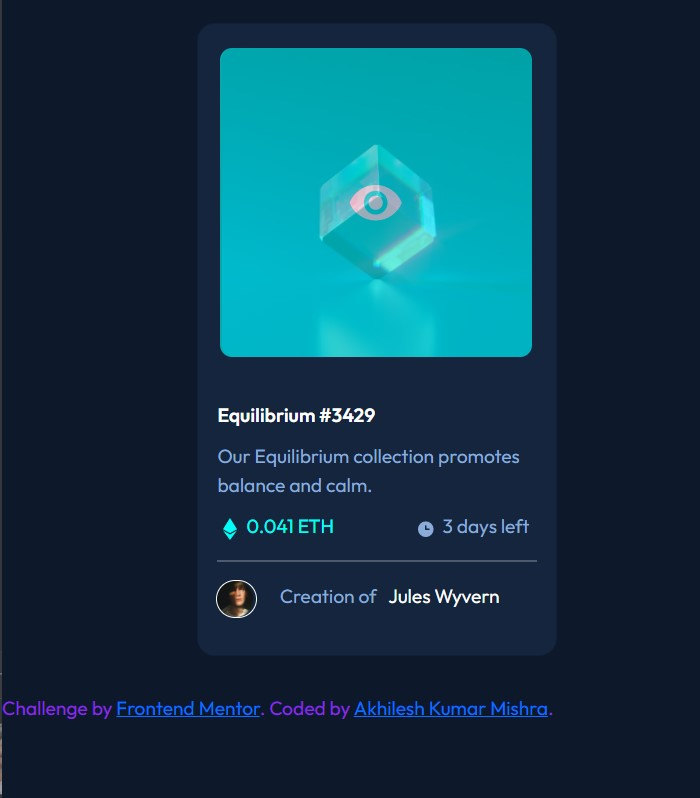

# Frontend Mentor - NFT preview card component solution

This is a solution to the [NFT preview card component challenge on Frontend Mentor](https://www.frontendmentor.io/challenges/nft-preview-card-component-SbdUL_w0U). Frontend Mentor challenges help you improve your coding skills by building realistic projects. 

## Table of contents

- [Overview](#overview)
  - [The challenge](#the-challenge)
  - [Screenshot](#screenshot)
  - [Links](#links)
- [My process](#my-process)
  - [Built with](#built-with)
  - [What I learned](#what-i-learned)
  - [Continued development](#continued-development)
  - [Useful resources](#useful-resources)
- [Author](#author)

## Overview

### The challenge

Users should be able to:

- View the optimal layout depending on their device's screen size
- See hover states for interactive elements

### Screenshot

### Links

- Solution URL: [Add solution URL here](https://your-solution-url.com)
- Live Site URL: [Add live site URL here](https://your-live-site-url.com)

## My process

### Built with

- HTML5 markup
- CSS custom properties
- Flexbox
- CSS Grid
- Bootstrap 4

### What I learned
This is my first frontend Challenge that i accepted reached as closer as i am able to , If you think i can change the style and get much more closer then please let me know.
While working in this challenge, I learn a lot about positioning the card and change a full fledge hover state over an image, that was the task I like most as it was little bit more challenging.

### Continued development

I am too beginner in this field hence whatever it will be possible i will get to know about them .

### Useful resources

- [W3 School](https://www.w3schools.com/) - This helped me whenever i struck at css modelling for the required challenge.
- [Codeply](https://www.codeply.com/) - This website help me to play with the code in online quicl run and code playground.

## Author

- Website - [Ahilesh Kumar Mishra](iamakhileshmishra.github.io)
- Frontend Mentor - [@iamakhileshmishra](https://www.frontendmentor.io/profile/iamakhileshmishra)
- Twitter - [@Akhilesh1m](https://www.twitter.com/akhilesh1m)
